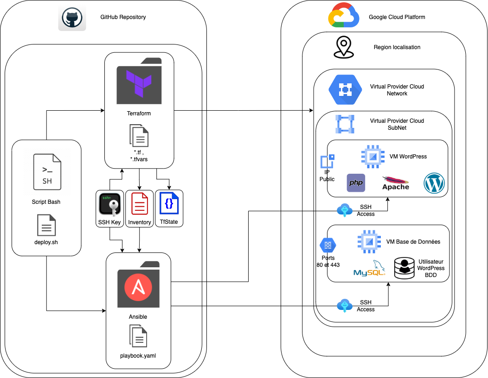

# TP1-VM_WORDPRESS

Documentation du Déploiement Automatisé d'un site WordPress sur Google Cloud Platform (GCP)

## Description l'Arborescence

``` sh
.
├── README.md
├── ansible
│   ├── ansible.cfg
│   ├── inventory.ini
│   ├── playbook.yml
│   ├── roles
│   │   ├── database
│   │   │   ├── handlers
│   │   │   │   └── main.yml
│   │   │   └── tasks
│   │   │       └── main.yml
│   │   └── wordpress
│   │       ├── handlers
│   │       │   └── main.yml
│   │       ├── tasks
│   │       │   └── main.yml
│   │       └── templates
│   │           └── wp-config.php.j2
│   └── vars.yml
├── creation-inventory.sh
├── credentials.json
├── deploy.sh
├── deployment-wordpress-gcp.drawio.png
├── ssh_keys
├── terraform
│   ├── db_vm
│   │   ├── main.tf
│   │   ├── outputs.tf
│   │   └── variables.tf
│   ├── firewall
│   │   ├── main.tf
│   │   ├── outputs.tf
│   │   └── variables.tf
│   ├── main.tf
│   ├── outputs.tf
│   ├── service_account
│   │   ├── main.tf
│   │   ├── outputs.tf
│   │   └── variables.tf
│   ├── terraform.tfstate
│   ├── terraform.tfstate.backup
│   ├── variables.tf
│   ├── vpc
│   │   ├── main.tf
│   │   ├── outputs.tf
│   │   └── variables.tf
│   └── wordpress_vm
│       ├── main.tf
│       ├── outputs.tf
│       └── variables.tf
├── terraform-destroy.sh
├── terraform.tfstate
└── tp_1_VM_WORDPRESS.pdf
```

- `README.md` : Ce fichier de documentation du projet.
- `ansible` : Ce répertoire contient les fichiers et les rôles Ansible pour le déploiement de l'application.
- `creation-inventory.sh` : Ce script sert à générer un fichier d'inventaire Ansible à partir de l'infrastructure.
- `credentials.json` : Ce fichier de configuration contient les informations d'identification pour se connecter au compte CGP
- `deploy.sh` : le script shell pour déployer l'application en utilisant Terraform et Ansible.
- `deployment-schema` : Le répertoire contenant des schémas de déploiement.
- ``ssh_keys`` : clés SSH pour l'infrastructure.
- ``terraform`` : Ce répertoire contient les fichiers Terraform pour le déploiement de l'infrastructure.
- ``terraform-destroy.sh`` : Le script pour détruire l'infrastructure créée avec Terraform.
- ``tp_1_VM_WORDPRESS.pdf`` : Le sujet du TP

## Description des pré-requis

Pour exécuter ce projet avec succès, vous devez vous assurer de disposer des éléments suivants :

- `Ansible` et `Terraform` installé.
- `Un compte GCP` avec les autorisations appropriées pour créer des machines virtuelles (VM) et des réseaux VPC.
- `Une clé SSH publique` nécessaire pour accéder aux machines virtuelles déployées
- ``Le credentials.json`` téléchargé depuis la console GCP et stockée a la racine du dossier
- ``La configuration de Google Cloud SDK`` il faut configurer Google Cloud SDK avec les informations d'identification GCP. Cela permettra d'interagir avec le projet GCP en ligne de commande.

## Schéma de présentation du déploiement

Voici le schéma permettant de visualiser le flux et l'inter-connection des différents ressources et services :



L'architecture se réalise en 2 VM, une pour `Wordpress` et une autre pour la `BDD MYSQL` :

- VM Wordpress accessible publiquement et contient le nécessaire pour l'application Wordpress.

- VM MYSQL non accessible publiquement et contient les données de l'application.

## Composition et Configuration du dossier Ansible

- `ansible.cfg` contient la configuration globale d'Ansible pour le tp. Il inclus des paramètres de configuration spécifiques à Ansible.

- `inventory.ini` est le fichier d'inventaire d'Ansible. Il répertorie les serveurs ou les hôtes que nous souhaitons gérer avec Ansible. Les adresses IP et les noms d'hôtes de nos VM sont dans le fichier.

- `playbook.yml` est le fichier principal d'Ansible. Il contient une liste d'actions à exécuter sur les machines hôtes répertoriés dans l'inventaire. Toutes les tâches automatisé sont dans le playbook.

- `roles` est le répertoires qui contient les rôles qui définissent les actions effectuer dans notre infrastructure. Dans ce tp 2 rôles sont crées "database" et "Wordpress". Chaque rôles contient les dossiers et fichiers nécessaires à leur bonne configuration et à leur bon fonctionnement.

- `vars.yml` est le fichier de variables d'Ansible.

- `db_vm` est le répertoire qui contient les fichiers spécifiques pour créer la vm pour la BDD. Ce dossier est composé de 3 fichiers :

  - `main.tf` est le fichier qui définit la configuration principale pour la vm.

  - `outputs.tf` est le fichier qui définit les outputs de la vm.

  - `variables.tf` est le fichier de variables spécifiques à la vm.

- `firewall`  est le répertoire qui contient les fichiers pour la configuration du pare-feu. Il contient les mêmes fichiers que le répertoires db_vm.

- `main.tf` est le fichier principal de Terraform. Il sert à la configuration général du tp.

- `outputs.tf` est le fichier définit les sorties globales dans le déploiement de l'infrastructure.

- `variables.tf` est le fichier qui définie les variables globales du projet.

- `service_account` est le répertoire qui contient les fichiers lié à la configuration du compte de service. Il contient les mêmes fichiers que le répertoires db_vm.

- `terraform.tfstate et terraform.tfstate.backup` sont les fichiers qui stockent l'état actuel de l'infrastructure Terraform. Ne surtout pas les modifier, Terraform les gère lui-même.

- `vpc` est le répertoire qui contient les fichiers du réseau virtuel. Il contient les mêmes fichiers que le répertoires db_vm.

- `wordpress_vm` est le répertoire contenant les fichiers pour la vm Wordpress. Il contient les mêmes fichiers que le répertoires db_vm.

## Composition et Configuration des scripts Bash

- `creation-inventory.sh` est le script qui génère un fichier inventaire Ansible dynamique à partir de l'infrastructure déployé par Terraform.

- `deploy.sh` est le script principal du projet. Il sert à déployer l'infrastructure.

- `terraform-destroy.sh` sert à détruire l'infrastructure crée avec Terraform.

## Déploiement de l'infrastructure

Lorsque tous est prêt et configuré , le script deploy.sh peut être lancé pour déployer l'infrastructure.

la commande est `./deploy.sh`

## Description étape par étape

### Étape 1/8: Définition et Configuration du projet GCP

- Définissez la variable d'environnement `GCP_PROJECT` pour le projet GCP à utiliser.
- Configurez le projet GCP en utilisant la commande `gcloud config set project`.

### Étape 2/8: Vérification de la présence de la clé SSH et Génération si nécessaire

- Vérifiez et créez le dossier `.ssh` s'il n'existe pas.
- Vérifiez l'existence d'une clé SSH dans le dossier `.ssh` et générez-en une si nécessaire.

### Étape 3/8: Vérification de Terraform et Installation si nécessaire

- Vérifiez l'installation de Terraform et installez-le si nécessaire en utilisant `apt`.

### Étape 4/8: Initialisation de Terraform et Création des machines

- Initialisez Terraform si c'est la première exécution du script.
- Créez des machines virtuelles en utilisant Terraform avec un fichier de configuration.

### Étape 5/8: Génération des inventaires dynamiques Ansible

- Générez un fichier d'inventaire dynamique `inventory.ini` avec les adresses IP externes des VM Terraform.
- Mettez à jour le fichier `vars.yml` avec les adresses IP internes des VM Terraform.

### Étape 6/8: Vérification de Ansible et Installation si nécessaire

- Vérifiez l'installation d'Ansible et installez-le si nécessaire en utilisant `apt`.

### Étape 7/8: Déploiement avec Ansible

- Déployez une application avec Ansible en utilisant un fichier `playbook.yml` et l'inventaire `inventory.ini`.

### Étape 8/8: Vérification du fonctionnement de l'application

- Vérifiez le bon fonctionnement de l'application WordPress en accédant à l'adresse IP publique de la VM WordPress avec `curl`.
- Affichez le résultat de la vérification, y compris le titre de la page WordPress.

## Destruction de l'infrastructure

Pour détruire l'infrastructure que vous avez créée à l'aide de Terraform, exécutez le script `terraform-destroy.sh` en utilisant la commande suivante : `./terraform-destroy.sh`

J'ai vidé toutes les variables qui dépendant du compte ou de la machine de l'utilisateur.
